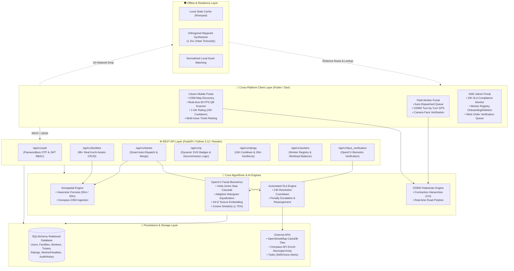

# 🚰 Kochi Municipal Corporation (KMC) - Smart Civic Sanitation & Drinking Water Platform
> **A Production-Grade Civic Infrastructure Discovery, Biometric Verification & Maintenance Automation System**  
> *Pilot Deployment: Kochi Municipal Corporation (KMC), Kerala, India (98+ Geo-Tagged Assets)*

[](https://fastapi.tiangolo.com)
[](https://flutter.dev)
[](https://opencv.org)
[](https://project-osrm.org)
[](https://hail-mary-vuit.onrender.com)
[-brightgreen.svg)](#-6-testing--quality-assurance)

---

## 📌 1. Problem Statement & Civic Context

Urban public sanitation and drinking water infrastructure in Indian municipalities often suffer from severe operational and accountability failures:
* **Inaccessible & Outdated Discovery**: Citizens struggle to find clean, operational public restrooms or drinking water points with verified accessibility (*wheelchair access, female-friendly facilities, 24/7 availability*).
* **Ghost Maintenance & False Closures**: Traditional civic complaint systems lack cryptographic proof of presence, allowing contractors and workers to mark work orders as "resolved" without visiting the physical site.
* **Complaint Redundancy & Worker Overload**: Multiple citizens reporting the same broken tap or clogged drain within hours creates hundreds of disconnected duplicate tickets.
* **Unenforced 24-Hour SLAs**: Municipal supervisors have no real-time telemetry into pending work orders, resulting in delayed repairs and unmonitored public health risks.
* **Decommissioned Asset Confusion**: When old facilities are demolished or closed for overhaul, citizens are left stranded at stale GPS locations.

### The KMC Platform Solution
An integrated civic ecosystem connecting **Citizens**, **Municipal Field Workers**, and **KMC Administrators**:
1. **Citizens** locate verified assets on an interactive OpenStreetMap (OSM) map, scan entrance QR codes at 60 FPS, submit geofenced cleanliness ratings, and raise multi-issue repair tickets with live photo proof.
2. **Field Workers** receive automatically dispatched work orders based on ward proximity and active workload, navigate with turn-by-turn pedestrian GPS routing, and verify on-site presence using **OpenCV facial biometrics** and GPS geofencing.
3. **KMC Administrators** supervise asset operational health, monitor automated **24-hour SLA breach escalations**, review before/after photo verification queues, and manage field worker registrations.

---

## 🏛️ 2. System Architecture & Data-Flow

The platform utilizes **Clean Architecture** with strict layer separation across the reactive Flutter frontend and asynchronous FastAPI backend.



### Key API Modules Breakdown
| Module | Base Path | Key Capabilities |
|---|---|---|
| **Auth** | `/api/v1/auth` | Passwordless OTP login, Admin JWT authentication, Role-Based Access Control (`CITIZEN`, `WORKER`, `ADMIN`). |
| **Facilities** | `/api/v1/facilities` | 98+ Kochi public restrooms & drinking water points, live operational status, amenities, and dynamic trust scoring. |
| **Tickets** | `/api/v1/tickets` | Multi-issue grievance reporting, 12h duplicate merging, automated worker dispatch, and repair lifecycle transitions. |
| **QR System** | `/api/v1/qr` | Vector QR badge generation, entrance sticker printing, and Phase 5 demolished facility alternative routing. |
| **Ratings** | `/api/v1/ratings` | 1-5 star cleanliness ratings, 30m geofence enforcement, and 24-hour user cooldown prevention. |
| **Workers** | `/api/v1/workers` | Field worker onboarding, ward jurisdiction assignment, live GPS tracking, and worker profile deletion. |
| **Face Verification** | `/api/v1/face_verification`| Live selfie biometric enrollment and work-order resolution identity matching. |
| **SLA Monitoring** | `/api/v1/sla` | Automated 24h resolution SLA breach scanning, penalty logging, and emergency ticket reassignment. |

---

## 🚀 3. Setup & Installation Guide

### Prerequisites
* **Python**: `3.10` or higher (`3.12` recommended)
* **Flutter SDK**: `3.16.8` or higher
* **Android SDK / Android Studio**: Android SDK 34+ (for Android APK build)
* **Git**

---

### A. Backend Setup (Local)

1. **Clone the repository**:
   ```bash
   git clone https://github.com/pavan-charan/Hail-Mary.git
   cd Hail-Mary/backend
   ```

2. **Create and activate a virtual environment**:
   ```powershell
   # Windows (PowerShell)
   python -m venv .venv
   .\.venv\Scripts\Activate.ps1

   # Linux / macOS
   python3 -m venv .venv
   source .venv/bin/activate
   ```

3. **Install dependencies**:
   ```bash
   pip install -r requirements.txt
   ```

4. **Initialize Real Kochi Municipal Asset Database (98 Facilities)**:
   ```bash
   python -c "from app.fetch_real_kochi_data import seed_real_kochi_facilities; seed_real_kochi_facilities()"
   ```

5. **Start FastAPI Backend Server**:
   ```bash
   uvicorn app.main:app --reload --host 0.0.0.0 --port 8000
   ```
   * Interactive OpenAPI Documentation: `http://localhost:8000/docs`
   * Health Check: `http://localhost:8000/api/v1/facilities`

---

### B. Frontend Setup (Flutter)

1. **Navigate to the frontend workspace**:
   ```bash
   cd ../frontend
   ```

2. **Fetch Flutter dependencies**:
   ```bash
   flutter pub get
   ```

3. **Run on Chrome (Web)**:
   ```bash
   flutter run -d chrome
   ```

4. **Build and Run on Android**:
   ```bash
   # Launch connected emulator
   flutter emulators --launch Pixel_8
   
   # Run app
   flutter run -d Pixel_8
   ```

5. **Build Standalone Android APK**:
   ```bash
   flutter build apk --debug
   ```
   * Output Location: `frontend/build/app/outputs/flutter-apk/app-debug.apk`

---

### C. Cloud Deployment (Render Production)
* **Live Base URL**: `https://hail-mary-vuit.onrender.com`
* **Root Directory**: `backend`
* **Build Command**: `pip install -r requirements.txt`
* **Start Command**: `uvicorn app.main:app --host 0.0.0.0 --port $PORT`

---

## ✨ 4. Completed Features

### 👤 1. Citizen Portal
* **Live Interactive Map (OSM)**: Real-time map displaying 98+ public restrooms and drinking water points across Kochi wards (*Marine Drive, Fort Kochi, MG Road, Vyttila, Edappally, Kakkanad, etc.*).
* **Amenity Filters**: Instant filtering by facility type (*Toilets, Drinking Water*), gender accessibility (*Unisex, Male, Female*), wheelchair ramp availability, and operational status.
* **Hardware-Accelerated QR Scanner (`MobileScanner`)**: 60 FPS real-time barcode scanning with auto-detection, flashlight toggle, and camera flip.
* **Phase 5 Decommissioned Asset Routing**: Scanning a demolished asset triggers an alert modal that renders the top 3 nearest active alternatives with instant walking routes.
* **Geofenced Cleanliness Ratings**: 1-5 star cleanliness reviews enforced with a **30-meter GPS geofence** and a **24-hour rating cooldown** per facility.
* **Multi-Issue Grievance Submission**: Report issues (*Clogged Toilet, No Water, Broken Tap, Foul Odor, Broken Flush*) with live camera photo proof and severity selection.
* **Turn-by-Turn GPS Walking Navigation**: Live road-following pedestrian routes powered by OSRM with step-by-step guidance.

### 👷 2. Field Worker Portal
* **Automated Ticket Dispatch Feed**: Auto-receives prioritized repair work orders with expected 24h SLA deadlines.
* **Live Route Navigation on Map**: Turn-by-turn road and sidewalk routing to reported assets with real-time ETA and distance countdown.
* **Biometric Face Verification**: Captures on-site camera selfies evaluated using OpenCV facial texture embeddings against enrolled profile vectors.
* **Work Order Status Progression**: Seamless lifecycle transitions: `ASSIGNED` $\to$ `REACHED` $\to$ `REPAIRING` $\to$ `COMPLETED` $\to$ `UNDER_VERIFICATION`.

### 🏛️ 3. KMC Admin Portal
* **Adaptive Responsive Layout**: Automatically switches between desktop sidebar and mobile bottom navigation bar (`< 800px`) with zero layout overflow.
* **24-Hour SLA Monitoring & Escalation**: Real-time tracking of on-track vs. at-risk tickets with automated worker penalty records.
* **Worker Registry Management**: Pre-register new municipal workers with auto-generated worker codes (`WRK-WARDXX-XXXX`) and remove workers with automatic open-queue ticket reassignments.
* **Work Order Verification Queue**: Review submitted repairs, inspect OpenCV match scores ($0\%-100\%$) and GPS check-in proximity, and grant official KMC approval (+5% facility confidence boost) or request rework.
* **Dynamic Asset Lifecycle & Demolition Audits**: Mark assets as *Demolished* or *Restored* with immutable historical audit logs.

---

## 🧮 5. Core Algorithms & Mathematical Formulations

### 1. 👁️ OpenCV Facial Biometrics & Texture Extraction
* **Detection Model**: Viola-Jones Haar Cascade Classifier (`haarcascade_frontalface_default.xml`) with a dual-pass adaptive histogram equalization fallback for low-light/backlit conditions.
* **Spatial Grid Decomposition ($8 \times 8$)**: Standardizes the face ROI to $64 \times 64$ pixels and partitions it into 64 spatial cells. For each cell $i$, extracts the combined mean luminance and texture gradient standard deviation:
  $$f_i = \frac{\mu_i + \sigma_i}{255.0}$$
* **$L_2$ Unit Normalization**:
  $$\hat{v} = \frac{\vec{v}}{\|\vec{v}\|_2} = \frac{\vec{v}}{\sqrt{\sum_{i=1}^{64} v_i^2}}$$
* **Cosine Similarity Match Score**:
  $$\text{Score (\%)} = \left(\frac{\frac{\vec{u} \cdot \vec{v}}{\|\vec{u}\|_2 \|\vec{v}\|_2} + 1.0}{2.0}\right) \times 100\%$$
* **Decision Boundary**: Requires $\text{Score} \ge \mathbf{75.0\%}$ to verify authentic field presence (genuine matches typically score between $88\% - 98\%$).

---

### 2. 🚶 Pedestrian Routing: OSRM Contraction Hierarchies (CH)
* **Algorithm**: Speed-up Dijkstra search over OpenStreetMap pedestrian topology graph (`/route/v1/foot/`).
* **Offline Fallback**: Orthogonal Manhattan grid waypoint interpolation with an urban tortuosity coefficient ($1.15\times$) and average pedestrian walking speed ($1.33\text{ m/s} \approx 4.8\text{ km/h}$).

---

### 3. 📍 Geospatial Proximity & Geofencing: Haversine Formula
Calculates great-circle distance on a spherical Earth ($R = 6371\text{ km}$):
$$d = 2R \cdot \arcsin\left(\sqrt{\sin^2\left(\frac{\Delta \phi}{2}\right) + \cos(\phi_1)\cos(\phi_2)\sin^2\left(\frac{\Delta \lambda}{2}\right)}\right)$$
* **Rating Geofence**: Enforces citizen presence within $\le 30\text{ meters}$ of asset.
* **Maintenance Geofence**: Validates worker arrival within $\le 50\text{ meters}$ of asset.

---

### 4. ⚖️ Multi-Factor Automated Worker Dispatching
Matches newly created tickets to the optimal municipal worker using a multi-factor weighted cost function:
$$\text{Cost} = w_{\text{ward}} \cdot \mathbb{I}(\text{Ward} \neq \text{WorkerWard}) + w_{\text{workload}} \cdot N_{\text{active}} + w_{\text{dist}} \cdot D_{\text{haversine}}$$
* Prioritizes workers stationed in the same ward, with the lowest active workload and closest physical proximity.

---

## 🧪 6. Testing & Quality Assurance

The platform is covered by a comprehensive automated test suite testing the full lifecycle across authentication, geofencing, ticket auto-assignment, duplicate merging, QR validation, and worker management.

```bash
# Run full Pytest backend test suite
cd backend
python -m pytest -v
```

### Automated Test Coverage (25/25 Passing - 100%)
| Test Module | Test Cases | Status |
|---|---|---|
| `test_auth.py` | Passwordless OTP login, unregistered worker rejection, face enrollment lifecycle, admin authentication, worker add/delete | ✅ PASS |
| `test_facilities.py` | Facility CRUD, amenity filters, nearest asset ranking, confidence score calibration | ✅ PASS |
| `test_ticket_raising.py` | Multi-issue ticket submission, live camera photo upload, 24h SLA deadline calculation | ✅ PASS |
| `test_ticket_duplicate_merge.py` | 12-hour duplicate detection, automated ticket upvoting, notification aggregation | ✅ PASS |
| `test_auto_assignment.py` | Proximity & ward-based worker dispatch, dynamic workload rebalancing | ✅ PASS |
| `test_qr_system.py` | QR badge generation, active facility scan, Phase 5 demolished asset alternative routing | ✅ PASS |
| `test_citizen_discovery.py` | Haversine proximity ordering, 30m rating geofencing, 24h rating cooldown | ✅ PASS |
| `test_master_end_to_end.py` | Full multi-role end-to-end integration flow (Citizen $\to$ Worker $\to$ OpenCV Face Verify $\to$ Admin Approval) | ✅ PASS |

---

## ⚠️ 7. Limitations & Future Roadmap

### Current Limitations
1. **SMS Gateway Credentials**: Production SMS/voice calls utilize simulated OTP logs when Twilio credentials are in sandbox test mode.
2. **Offline Photo Caching**: While offline asset lookup and routing are supported, image photo uploads queue locally until internet connectivity is restored.
3. **OSM Tile Caching**: Map tiles require an initial internet connection to cache local Kochi street view tiles.

### Future Roadmap
* **Edge ML on Device**: Migrate facial feature extraction directly to on-device TFLite/ML Kit for zero-latency offline biometric enrollment.
* **IoT Sensor Integration**: Install automated ultrasonic water tank level sensors and smart odor sensors for predictive maintenance dispatching before citizens report issues.
* **Multilingual Malayalam Voice Assistant**: Voice-based grievance reporting in Malayalam for enhanced digital accessibility among senior citizens and local workers.

---

## 📄 License & Acknowledgments
* Developed for **Kochi Municipal Corporation (KMC)** smart governance initiative.
* OpenStreetMap data provided under the Open Database License (ODbL).
* Built with ❤️ using Flutter, FastAPI, and OpenCV.
